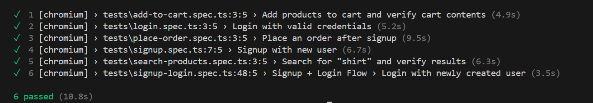
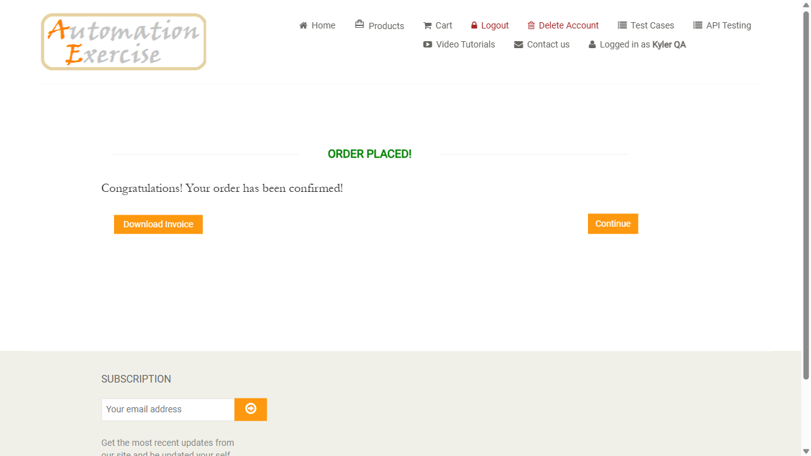
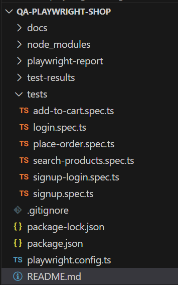

# 🛒 Playwright End-to-End Test Suite – AutomationExercise Demo Shop

## ✅ Summary (for recruiters & hiring managers)

This is a personal QA automation project built using **Playwright + TypeScript** to simulate real-world user interactions on an e-commerce website. It covers:
- User signup/login flows
- Shopping cart
- Product search
- Checkout logic
- Order placement & account deletion
- State cleanup

> ⚡ Built to showcase practical automation skills aligned with modern QA expectations.

---

## 📂 Project Structure

```
qa-playwright-shop/
├── tests/
│   ├── add-to-cart.spec.ts
│   ├── login.spec.ts
│   ├── signup.spec.ts
│   ├── signup-login.spec.ts
│   ├── search-products.spec.ts
│   └── place-order.spec.ts
├── playwright.config.ts
├── package.json
├── .gitignore
├── test-results/
└── playwright-report/
```

---

## 🧪 Test Coverage Breakdown

### 🛒 `add-to-cart.spec.ts`
- Adds multiple items to cart
- Verifies product names, prices, and quantities
- Optional cart cleanup

### 🔐 `signup.spec.ts` & `login.spec.ts`
- New user registration & login form tests

### 🔁 `signup-login.spec.ts`
- Full session flow

### 🔍 `search-products.spec.ts`
- Product search test with assertions on results

### 💳 `place-order.spec.ts`
- Registers a new user
- Adds a product to cart
- Completes checkout with card details
- Asserts order confirmation
- Deletes account

---

## 🧰 Tech Stack
- [Playwright](https://playwright.dev) with TypeScript
- Node.js & npm
- VS Code
- Built-in HTML report and trace viewer

---

## ▶️ How to Run Tests

1. Install dependencies:
```bash
npm install
```

2. Run all tests:
```bash
npx playwright test
```

3. Run a specific test:
```bash
npx playwright test tests/add-to-cart.spec.ts
```

4. Debug a test:
```bash
npx playwright test --headed --project=chromium --slow-mo=300
```

---

## 📸 Screenshots

### ✅ Passing Test Run



### 💳 Order Confirmation Page



### 🧪 Test Folder Structure



---

## 🧼 Cleanup Logic

Each flow that alters cart/account state includes cleanup steps such as:
```ts
await page.click('a.cart_quantity_delete[data-product-id="1"]');
```

---

## 📬 Contact

Open to QA automation opportunities – feel free to connect on [LinkedIn](https://www.linkedin.com/in/kyler-peasnall/) or message me here.
